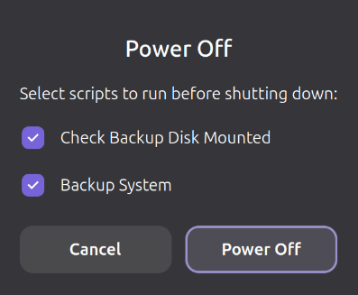
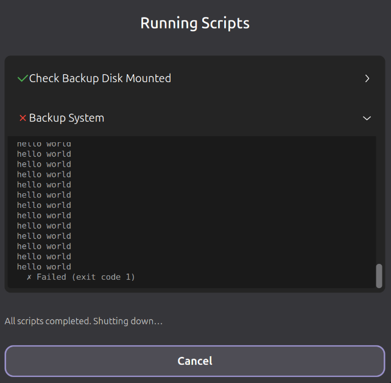
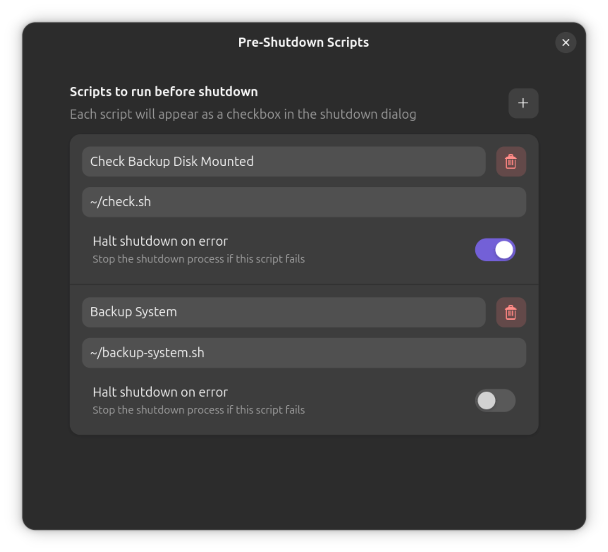

# Pre-Shutdown Scripts
This is a GNOME extension, that will add options for scripts to run before shutdown. You can configure what scripts to run from the extension settings menu and if a failure should halt the shutdown.

## Selection
[]

## Execution
[]

## Settings
[]
